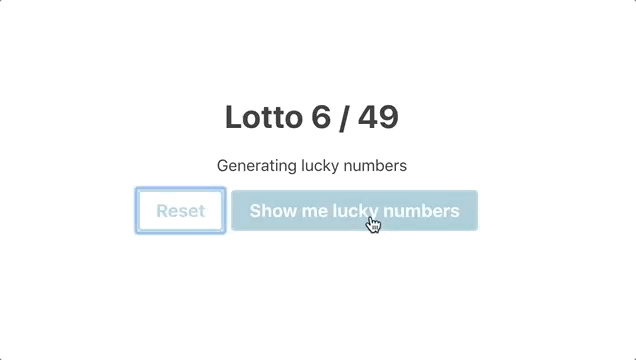
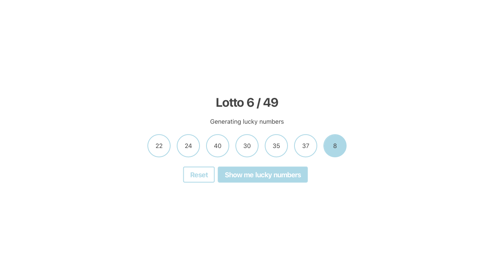

# Lotto numbers

Let's create a `LuckyNumbers` component.

It should display 2 buttons.

On click on one of them (Show me lucky numbers), 6 numbers between 1 and 49 should be generated and displayed. All of the 6 numbers must be unique.

In addition one number between 1 and 10 should be generated and displayed. Every time you click the button a new set of lucky numbers should be generated and displayed.

On clicking on the Reset button all numbers should be hidden.

